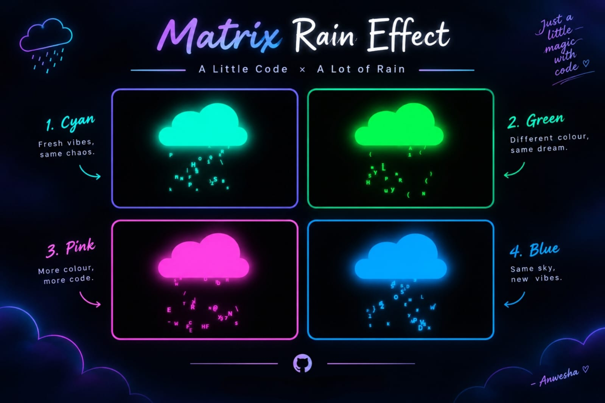

# ☁️ Matrix Cloud Rain

<p align="center">
  <strong>A little code. A little rain. A whole lot of neon.</strong>
</p>

<p align="center">
  A mesmerizing, neon Matrix-style digital rain animation nestled inside a glowing cloud, built with pure 
  <strong>HTML</strong>, <strong>CSS</strong>, and <strong>JavaScript</strong>.
</p>

<p align="center">
  <a href="https://aiwithanwesha.github.io/matrix-cloud-rain/">
    
  </a>
</p>

---

## ✨ Features

- ☁️ **Neon Cloud**  
  A glowing cloud created entirely with CSS shapes and shadows.

- 🟢 **Digital Rain**  
  Randomized Matrix-style characters generated dynamically with JavaScript.

- 🌈 **Dynamic Colours**  
  Smooth colour changes create a vibrant neon atmosphere.

- ⚡ **Vanilla JavaScript**  
  Built without heavy frameworks or libraries.

- 📱 **Responsive Design**  
  Designed to adapt to different screen sizes.

---

## 🛠️ Built With

<p align="center">
  
</p>

<p align="center">
  <sub>HTML5 •  CSS3 •  JavaScript •  GitHub</sub>
</p>

---

## 🖥️ Preview

> A glowing cloud meets a stream of digital characters — created entirely with code.

<p align="center">
  
</p>

---

## 💡 About The Project

**Matrix Cloud Rain** is a small creative-coding project built to explore
CSS shapes, neon glow effects, animations, and dynamic DOM manipulation
using JavaScript.

The goal was simple:

> **Turn a few lines of code into something visually interesting.**

---

## 🚀 Run Locally

### 1. Clone the repository

```bash
git clone https://github.com/aiwithanwesha/matrix-cloud-rain.git

```

---

## ✦ Behind The Code

<div align="center">

Designed, developed, and maintained with ❤️ by **Anwesha**  

*• © 2026 Cloud • Where Code Meets Rain •*

</div>
